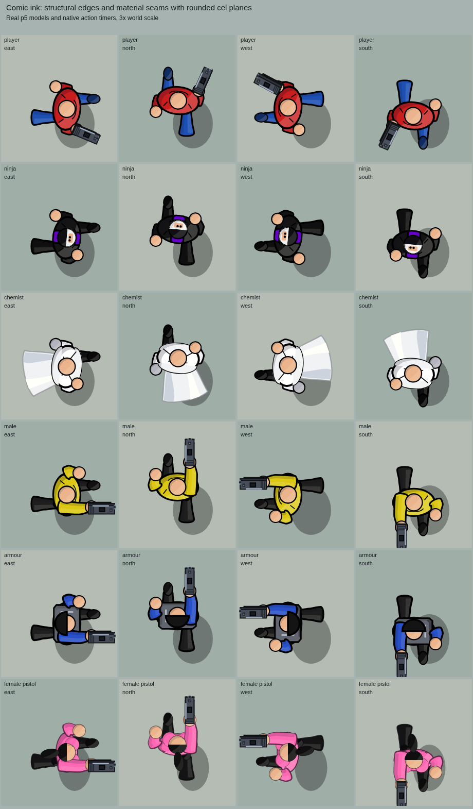
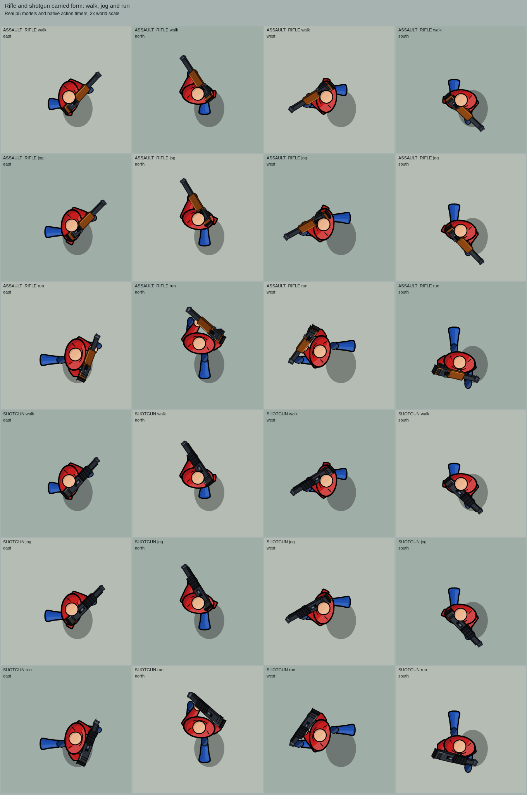
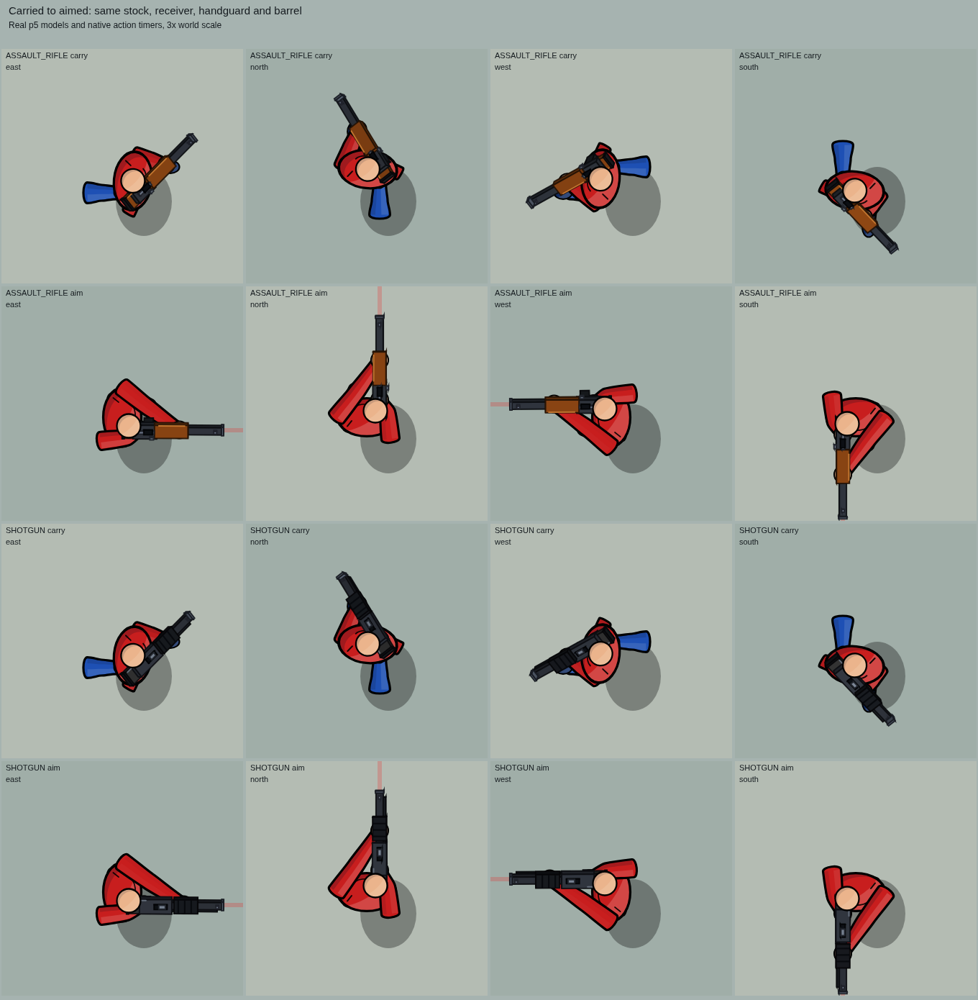

# Comic ink and rifle/shotgun refinement

Live humanoids now have hard black silhouettes, armor rims, lapels and short
fabric folds over their curved cel shaded surfaces. Sleeves and trouser legs
remain continuous through the joints. The approved female pistol model and
corpse artwork retain their softer contours.

Rifles and shotguns use the same projected solid model when carried, aimed or
fired. Stocks, receivers, barrels, sights and magazines have distinct cel
planes and material edges. Rifle recoil moves the charging handle; shotgun
firing cycles the pump with the support hand attached. Both hands follow their
grips. The muzzle, flash and aim line stay aligned with the existing projectile
origin while moving. Combat timers, ammunition and ballistics are unchanged.

## Browser previews

Actual p5 renders at three times world scale:

[Native firing, recoil and pump animation](previews/comic-refinement-actions.mp4)
is shown at half speed for inspection.

## Validation

The selective ink suite passes 132 checks, including baseline comparisons of
female pistol and corpse painter traces. The long-gun suite passes 22 checks
for shared geometry, both grip positions, recoil, pump timing and visual muzzle
registration with native shots. Character, handgun, left action, figure volume,
render, depth, city people, corpse, fall and bow control checks also pass.

Browser review covered 416 pose cards without JavaScript errors or unbalanced
painter state. Forty female pistol and corpse poses match the previous pixels
exactly. Native Canvas paths and the p5 fallback match pixels and painter state
across 480 poses. A 31-frame native firing sequence covers both weapons in four
headings. Mobile touch movement, aim and fire passed in levels 1 and 2 on a
390 × 844 canvas, without JavaScript errors or unbalanced painter state.
