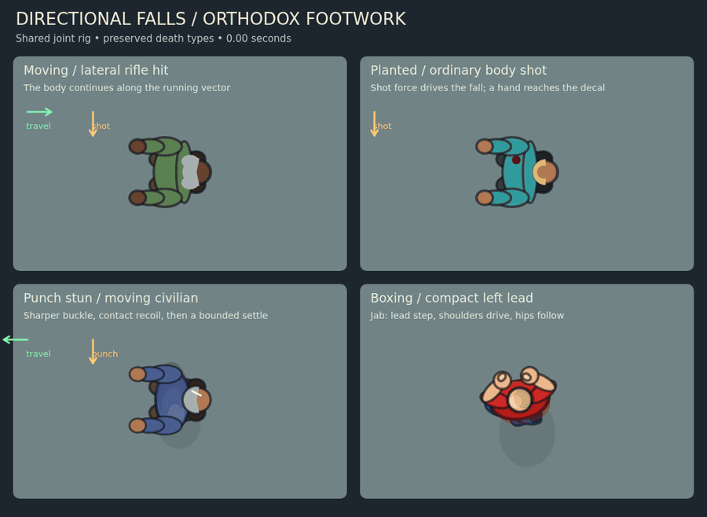

# Directional falls and boxing footwork

Humanoid corpse falls and punch stuns now share a projected two-bone rig. Actual locomotion is frozen before bullet knockback: a moving actor falls along that vector, while a planted actor responds to the incoming shot or punch. The bullet's entry position is captured before knockback too, so body-side reactions and wound holding use the decal that actually landed.

Whole-body deaths reach ground contact in roughly 53–59 simulation frames for firearms, followed by a 16-frame contact recoil and settle. Punch stuns buckle more sharply over 40 frames with a stronger recoil. The torso, head, shoulders, hips and limbs change projection together; signed leg foreshortening tucks the knees underneath the pelvis before the heels extend onto the floor. Additional torso spin is limited to 0.26 radians so it cannot overwhelm the chosen fall direction. The final joint state freezes and existing corpse retirement still stamps it into the blood bank. Leaving a biome fast-forwards the same fall and limb clocks together.

Ordinary body-shot deaths can randomly fold the nearer hand over the actual wound. Headshots and every existing overkill type are excluded. Off-center body hits bias the corresponding shoulder and elbow, with a small torso roll during the fall. A lethal hit on a stunned actor continues the already fallen pose. Unarmed civilians no longer produce a phantom dropped pistol.

Death selectors, damage thresholds, headshot cycles, close-range overkill cycles, gib pieces, death sound triggers, kill accounting and civilian stun durations are retained. This pass changes animation and impact metadata. It does not introduce new death types or a general physics engine.

The orthodox guard uses a compact left lead/right rear stance with less resting hip and torso rotation. Forward, backward and lateral movement alternate planted steps and lifted feet without crossing. The lead steps into a jab; the rear heel lifts and pivots into a cross, with the hips following the shoulders. The existing 180-frame guard hold after the completed punch remains.

## Verification

`node tools/check-falls-and-footwork.js` exercises actual bullet hits as well as the shared rig: opposed movement/force, planted reactions, fall pacing, frozen settled state, wall collision, pre-knockback metadata, every pistol/rifle/shotgun headshot cycle, every close shotgun body-overkill cycle, distant shotgun and close dual-SMG selection, random wound holding, downed death continuity, player/NPC motion capture, compact guard, uncrossed forward/back/lateral steps, heel pivot and finite balanced drawing.

The city people check passes. Existing checks pass: character 71/71, corpse 87/87, population 130/130, save/load 33/33, depth 95/95, lighting 112/112, render 179/179, ballistics 17/17 and damage feedback 25/25. The real Chromium/p5 frame check passes 12/12 over 90 frames, including the lighting fallback and control-stack checks. The animation preview also renders the real p5 model and advances the actual fall/stun controllers. Mobile hardware performance and a manual full combat playthrough have not been measured.

```
VIS_DEPS=/path/to/deps VIS_CHROME=/path/to/chrome node tools/visual-falls-and-footwork.js animate
```

The preview deliberately selects one eligible wound-holding variant. Arrows identify the initial travel and impact vectors; ordinary play chooses wound holding randomly.



Still preview: [falls-and-footwork.png](previews/falls-and-footwork.png).
