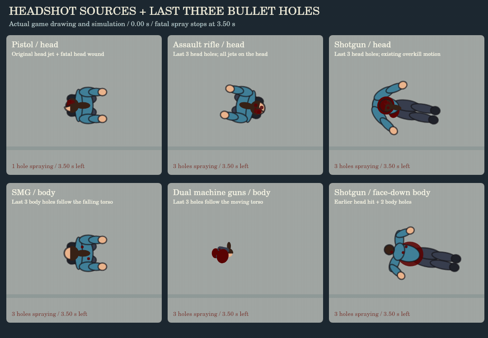

# Directional falls and boxing footwork

Ordinary humanoid corpse falls and punch stuns use a projected two-bone rig. Actual locomotion is frozen before bullet knockback: a moving actor falls along that vector, while a planted actor responds to the incoming shot or punch. The bullet's entry position is captured before knockback too, so body-side reactions and wound holding use the decal that actually landed.

Corpse collapse retains the previous 0.15-per-frame speed, reaching the floor on the seventh simulation frame. The previous 34-frame limb settle and spring rates are restored. Weapon force still affects displacement, but does not slow the collapse. Punch stuns retain their 40-frame buckle and 16-frame contact settle. The torso, head, shoulders, hips and limbs change projection together; signed leg foreshortening tucks the knees underneath the pelvis before the heels extend onto the floor. Ordinary directional falls limit additional torso spin to 0.26 radians. Final joints freeze and existing corpse retirement still stamps the body into the blood bank.

Shotgun and dual-SMG overkill use the pre-refinement animation path: their original orientation, limb drawing, head scale, separation, dismembered pieces and timings. The directional controller is excluded from these reactions. Head appearance follows the actor’s facing relative to the frozen fall vector, for both killed and stunned bodies. A forward fall shows the back of the head and hair; a backward fall rolls the head face-up and exposes skin, closed eyes and the nose. The same rule works in every map direction. Head wounds retain their damaged shapes. A killed, already stunned actor keeps its head side on the first rendered frame, and streamed/saved city residents keep their stun facing and fall direction. Detached hats stay in their original body/world frame, and off-screen corpse stamping uses the same corrected head transform.

Ordinary body-shot deaths can randomly fold the nearer hand over the actual wound. Headshots and every existing overkill type are excluded. Off-center body hits bias the corresponding shoulder and elbow, with a small torso roll during the fall. A lethal hit on a stunned actor continues the already fallen pose. Unarmed civilians no longer produce a phantom dropped pistol.

Every biological projectile kill with a fatal-hit decal emits blood for 210 simulation ticks (3.5 seconds at 60 Hz), including ordinary body shots. Shotgun, assault rifle, SMG and dual-SMG kills use the last three actual bullet holes, including the lethal hit; one or two available holes produce only that many streams. Pistol and other weapon kills keep the single fatal-hole stream. Nonbullet marks such as hide patterns and scorch stains are excluded. Selected wounds are frozen, and each emitter follows its own decal’s body/head transform, head roll, separation and moving torso pieces. Multiple wound jets receive separate random directions at death, with narrow jitter around each direction. Their common body/piece frame keeps mixed head/body jets apart as the head rolls. Single-wound kills keep the original shot-directed stream. Piece renderers that previously omitted bullet decals keep the selected spots on the surviving pieces. Face-down shotgun bodies also retain earlier head holes on the head. Robots retain their oil/spark effects. Nonfatal or stale wounds do not start a death stream.

The spray uses one pooled droplet per selected hole every two ticks and a gradual pressure reduction. All holes share the same 210-tick cutoff. Direction selection and droplet jitter use their own deterministic sequence, preserving the game’s global random draws. Headshot deaths retain the original blood stain from the neck down the collar and chest, drawn over the shirt and beneath the sleeves. Separate head marks remain inside the head transform and silhouette. The initial blood/gore/bone bursts and timed head jets stay at the head wound. Existing dismemberment effects retain their counts and timing. Pauses freeze the timer; killcam slows it with the simulation. Off-screen bodies finish the timer without particles. Active sprays are protected from pile culling, then the body stamps normally. Leaving a biome retires the body and stops its transient emitter.

Ground blood generated by `spawnSplatter()` now builds up over 90 simulation ticks (1.5 seconds): the precomputed blobs appear from the center outward, with each blob growing through four small-to-large stages. Deposition is permanent on the floor layer beneath corpses, with identical world positions across chunk seams. It preserves the original blob pattern and blood colors without new global random draws. The built-in pools under face-down human and gator shotgun bodies also grow in size and opacity over the same duration. Scorch remains immediate. Pauses freeze growth; off-screen puddles finish normally. Pending growth is banked with its biome, resumes on return and is cleared on restart.

Death selectors, damage thresholds, headshot cycles, close-range overkill cycles, gib pieces, death sound triggers, kill accounting and civilian stun durations are retained. This pass changes animation, impact metadata and wound effects. It does not introduce new death types or a general physics engine.

The orthodox guard uses a compact left lead/right rear stance with less resting hip and torso rotation. Forward, backward and lateral movement alternate planted steps and lifted feet without crossing. The lead steps into a jab; the rear heel lifts and pivots into a cross, with the hips following the shoulders. The existing 180-frame guard hold after the completed punch remains.

## Verification

`node tools/check-falls-and-footwork.js` exercises actual bullet hits as well as the shared rig: opposed movement/force, planted reactions, the original corpse speed, frozen settled state, wall collision, pre-knockback metadata, pistol/rifle/shotgun/dual-SMG headshot cycles, close shotgun and dual-SMG overkill exclusion, distant ordinary heavy-weapon deaths, random wound holding, downed death continuity, player/NPC motion capture, compact guard, uncrossed forward/back/lateral steps, heel pivot and finite balanced drawing.

`tools/check-fall-corrections.js` verifies transformed forward/back head drawing in all four cardinal directions, unchanged body direction, long hair, detached hat position, balanced transforms, and graphics-target drawing. With the pre-refinement game supplied, 84 controlled shotgun/dual-SMG overkill samples match its animation state and transformed body/limb/gib drawing, including the restored clothing stain. Additional head marks and gradual ground-puddle growth are excluded from that comparison and checked separately.

`node tools/check-fatal-wounds.js` exercises actual pistol, SMG, rifle, shotgun and dual-SMG kills; fatal/nonfatal/stale wound metadata; 145 painted-decal origin samples including a rolling head and moving/separating pieces; face-up/face-down heads on deaths and slow punch stuns; death while already down; the exact 210-tick cutoff; pause, off-screen, stack and travel retirement; recycled particles; and unchanged heavy overkill state and global random sequences. The city-people check also verifies backward-stun orientation after serialization and streaming.

`node tools/check-spray-sources.js` exercises actual three-hit histories for all four requested weapons, distinct randomized jet directions, pistol single-hole behavior, selection of the latest holes, fewer available holes, nonbullet-mark exclusion and frozen metadata. It compares 198 mixed head/body origins with the actual painted decals and checks separated jet directions at every sample, restored clothing stains, separate head marks, 12 legacy head jets, 15 actual initial headshot bursts, pause and the exact shared cutoff (315 droplets for three holes over 210 ticks).

`node tools/check-blood-pools.js` checks incremental center-out floor painting, growing droplets, final seam geometry, permanent floor/body layering, unchanged global randomness, pause, biome banking and return, restart cleanup, blood colors, off-screen completion, immediate scorch and gradual human/gator face-down pools with unchanged settled motion.

The update passes the city people and directional-fall checks, plus character 71/71, corpse 89/89, save/load 33/33, depth 95/95, lighting 112/112, render 179/179, ballistics 17/17, damage feedback 25/25 and robot 38/38 regressions. The broader performance check passes 48/49: its remaining source assertion expects `if (e.isFriendly)` for formation slots, while both this version and the preceding version use `if (e.isFriendly && !e.isCityCivilian)`. That existing assertion also fails against the preceding version; functional formation checks and the logic-frame budget pass. The original p5/Chromium frame run passed 12/12; it was not repeated for this update because that browser/dependency bundle is unavailable in the resumed workspace. The preview calls real game painters and update controllers against a Canvas drawing target. Mobile hardware performance and a manual full combat playthrough have not been measured.

```
git show a9f6db7e7a4aa4d14e31e0c2e5765edcbdc14dee:game.js > /tmp/pre-directional-game.js
FALL_LEGACY_GAME=/tmp/pre-directional-game.js node tools/check-fall-corrections.js
node tools/check-fatal-wounds.js
node tools/check-spray-sources.js
node tools/check-blood-pools.js
node tools/visual-spray-sources.js animate
```

The current preview calls actual corpse painters, fall controllers, ground-blood banks and deposition, legacy head jets and blood particles. It shows restored clothing stains, distinct random wound jets, growing floor puddles, moving torso pieces and a face-down shotgun body. It runs 4.5 seconds so buildup, the 3.5-second spray cutoff and final pose are visible. The earlier [head/fall preview](previews/fatal-wounds.gif) remains available for the prior directional-head and slow-stun changes.



Still preview: [spray-sources.png](previews/spray-sources.png).
