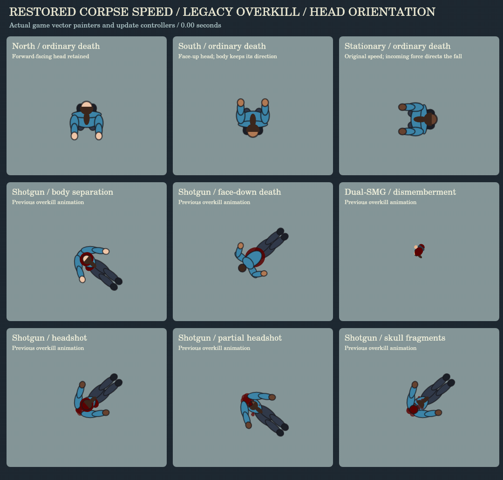

# Directional falls and boxing footwork

Ordinary humanoid corpse falls and punch stuns use a projected two-bone rig. Actual locomotion is frozen before bullet knockback: a moving actor falls along that vector, while a planted actor responds to the incoming shot or punch. The bullet's entry position is captured before knockback too, so body-side reactions and wound holding use the decal that actually landed.

Corpse collapse retains the previous 0.15-per-frame speed, reaching the floor on the seventh simulation frame. The previous 34-frame limb settle and spring rates are restored. Weapon force still affects displacement, but does not slow the collapse. Punch stuns retain their 40-frame buckle and 16-frame contact settle. The torso, head, shoulders, hips and limbs change projection together; signed leg foreshortening tucks the knees underneath the pelvis before the heels extend onto the floor. Ordinary directional falls limit additional torso spin to 0.26 radians. Final joints freeze and existing corpse retirement still stamps the body into the blood bank.

Shotgun and dual-SMG overkill use the pre-refinement animation path: their original orientation, limb drawing, head scale, separation, dismembered pieces and timings. The directional controller is excluded from these reactions. Southward directional corpses rotate the head alone face-up; northward forward-fall head orientation is retained. Detached hats stay in their original body/world frame, and off-screen corpse stamping uses the same corrected head transform.

Ordinary body-shot deaths can randomly fold the nearer hand over the actual wound. Headshots and every existing overkill type are excluded. Off-center body hits bias the corresponding shoulder and elbow, with a small torso roll during the fall. A lethal hit on a stunned actor continues the already fallen pose. Unarmed civilians no longer produce a phantom dropped pistol.

Death selectors, damage thresholds, headshot cycles, close-range overkill cycles, gib pieces, death sound triggers, kill accounting and civilian stun durations are retained. This pass changes animation and impact metadata. It does not introduce new death types or a general physics engine.

The orthodox guard uses a compact left lead/right rear stance with less resting hip and torso rotation. Forward, backward and lateral movement alternate planted steps and lifted feet without crossing. The lead steps into a jab; the rear heel lifts and pivots into a cross, with the hips following the shoulders. The existing 180-frame guard hold after the completed punch remains.

## Verification

`node tools/check-falls-and-footwork.js` exercises actual bullet hits as well as the shared rig: opposed movement/force, planted reactions, the original corpse speed, frozen settled state, wall collision, pre-knockback metadata, pistol/rifle/shotgun/dual-SMG headshot cycles, close shotgun and dual-SMG overkill exclusion, distant ordinary heavy-weapon deaths, random wound holding, downed death continuity, player/NPC motion capture, compact guard, uncrossed forward/back/lateral steps, heel pivot and finite balanced drawing.

`tools/check-fall-corrections.js` verifies transformed north/south head drawing, unchanged body direction, long hair, detached hat position, balanced transforms, and graphics-target drawing. With the pre-refinement game supplied, 84 controlled shotgun/dual-SMG overkill samples match its animation state and transformed vector drawing exactly.

The correction passes the city people check and existing character 71/71, corpse 87/87, save/load 33/33, depth 95/95, lighting 112/112, render 179/179, ballistics 17/17 and damage feedback 25/25 checks. The original p5/Chromium frame run passed 12/12; it was not repeated for this correction because that browser/dependency bundle is unavailable in the resumed workspace. The correction preview calls the real `Corpse.show()` and update controllers against a Canvas drawing target; it does not duplicate the game geometry. Mobile hardware performance and a manual full combat playthrough have not been measured.

```
git show a9f6db7e7a4aa4d14e31e0c2e5765edcbdc14dee:game.js > /tmp/pre-directional-game.js
FALL_LEGACY_GAME=/tmp/pre-directional-game.js node tools/check-fall-corrections.js
node tools/visual-fall-corrections.js animate
```

The correction preview covers northward, southward and stationary ordinary falls, plus the restored shotgun and dual-SMG overkill cases. The existing p5 motion tool remains available for a complete boxing/stun preview when its dependencies are installed.



Still preview: [fall-corrections.png](previews/fall-corrections.png).
