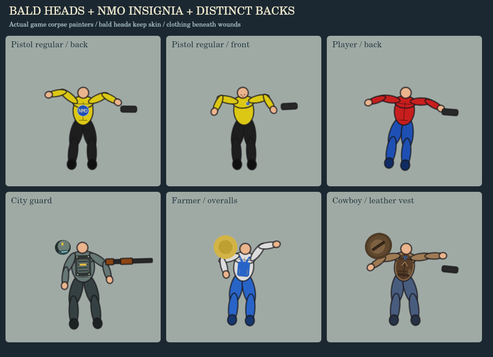
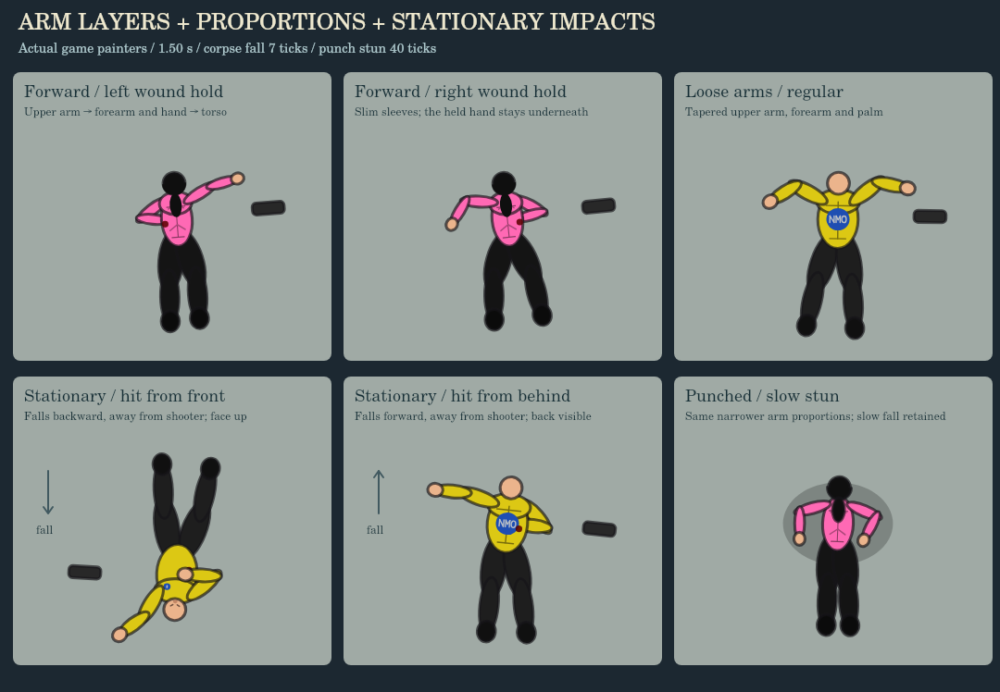
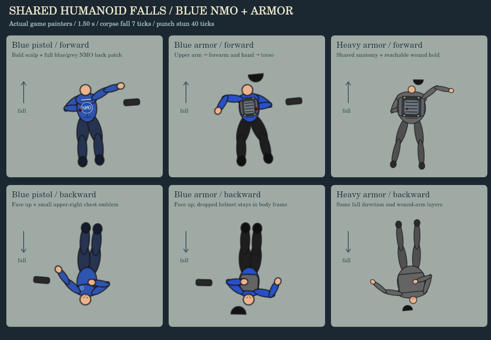

# Directional falls and boxing footwork

Ordinary humanoid corpse falls and punch stuns use a projected two-bone rig. Actual locomotion is frozen before bullet knockback: a moving actor falls along that vector, while a stationary bullet fatality falls along the bullet’s travel direction, away from the shooter, without a rotating turn; punch stuns retain their incoming-punch direction. The bullet's entry position is captured before knockback too, so body-side reactions and wound holding use the decal that actually landed.

Corpse collapse retains the previous 0.15-per-frame speed, reaching the floor on the seventh simulation frame. The previous 34-frame limb settle and spring rates are restored. Weapon force still affects displacement, but does not slow the collapse. Punch stuns retain their 40-frame buckle and 16-frame contact settle. The torso, head, shoulders, hips and limbs change projection together; signed leg foreshortening tucks the knees underneath the pelvis before the heels extend onto the floor. Ordinary directional falls limit additional torso spin to 0.26 radians. Final joints freeze and existing corpse retirement still stamps the body into the blood bank.

Shotgun and dual-SMG overkill use the pre-refinement animation path: their original orientation, limb drawing, head scale, separation, dismembered pieces and timings. The directional controller is excluded from these reactions. Head appearance follows the actor’s facing relative to the frozen fall vector, for both killed and stunned bodies. A forward fall shows the back of the actual head, with hair only where the living character has it; a backward fall rolls the head face-up and exposes skin, closed eyes and the nose. The same rule works in every map direction. Head wounds retain their damaged shapes. A killed, already stunned actor keeps its head side on the first rendered frame, and streamed/saved city residents keep their stun facing and fall direction. Detached hats stay in their original body/world frame, and off-screen corpse stamping uses the same corrected head transform.

Ordinary body-shot deaths can randomly fold the nearer hand over the actual wound. Headshots and every existing overkill type are excluded. Off-center body hits bias the corresponding shoulder and elbow, with a small torso roll during the fall. A lethal hit on a stunned actor continues the already fallen pose. Unarmed civilians no longer produce a phantom dropped pistol.

Every biological projectile kill with a fatal-hit decal emits blood for 210 simulation ticks (3.5 seconds at 60 Hz), including ordinary body shots. Shotgun, assault rifle, SMG and dual-SMG kills use the last three actual bullet holes, including the lethal hit; one or two available holes produce only that many streams. Pistol and other weapon kills keep the single fatal-hole stream. Nonbullet marks such as hide patterns and scorch stains are excluded. Selected wounds are frozen, and each emitter follows its own decal’s body/head transform, head roll, separation and moving torso pieces. Multiple wound jets receive separate random directions at death, with narrow jitter around each direction. Their common body/piece frame keeps mixed head/body jets apart as the head rolls. Single-wound kills keep the original shot-directed stream. Piece renderers that previously omitted bullet decals keep the selected spots on the surviving pieces. Face-down shotgun bodies also retain earlier head holes on the head. Robots retain their oil/spark effects. Nonfatal or stale wounds do not start a death stream.

The spray uses one pooled droplet per selected hole every two ticks and a gradual pressure reduction. All holes share the same 210-tick cutoff. Direction selection and droplet jitter use their own deterministic sequence, preserving the game’s global random draws. Headshot deaths retain the original blood stain from the neck down the collar and chest, drawn over the shirt and beneath the sleeves. Separate head marks remain inside the head transform and silhouette. The initial blood/gore/bone bursts and timed head jets stay at the head wound. Existing dismemberment effects retain their counts and timing. Pauses freeze the timer; killcam slows it with the simulation. Off-screen bodies finish the timer without particles. Active sprays are protected from pile culling, then the body stamps normally. Leaving a biome retires the body and stops its transient emitter.

Ground blood generated by `spawnSplatter()` now builds up over 90 simulation ticks (1.5 seconds): the precomputed blobs appear from the center outward, with each blob growing through four small-to-large stages. Deposition is permanent on the floor layer beneath corpses, with identical world positions across chunk seams. It preserves the original blob pattern and blood colors without new global random draws. The built-in pools under face-down human and gator shotgun bodies also grow in size and opacity over the same duration. Scorch remains immediate. Pauses freeze growth; off-screen puddles finish normally. Pending growth is banked with its biome, resumes on return and is cleared on restart.

Death selectors, damage thresholds, headshot cycles, close-range overkill cycles, gib pieces, death sound triggers, kill accounting and civilian stun durations are retained. This pass changes animation, impact metadata and wound effects. It does not introduce new death types or a general physics engine.

The orthodox guard uses a compact left lead/right rear stance with less resting hip and torso rotation. Forward, backward and lateral movement alternate planted steps and lifted feet without crossing. The lead steps into a jab; the rear heel lifts and pivots into a cross, with the hips following the shoulders. The existing 180-frame guard hold after the completed punch remains.

## Bald heads and outfit backs

Bald yellow and blue male pistol regulars and the player retain skin on the back of their heads. The blue male NM-0 pistol unit no longer draws its old crown/tie hair art on living, stunned or dead figures. Female blue units retain their actual hair. An assigned hair color alone no longer creates a hair cap; actual hairstyles, braids and receding crowns are retained. This applies to ordinary deaths, slow punch stuns and the legacy face-down shotgun death. A worn ninja hood shows its fabric back instead of its face opening.

Standard male regulars and both blue NM-0 pistol uniforms have a blue circular back patch containing grey vector **NMO** lettering. A grey rim keeps it visible against blue clothing. Their upper right chest has a small blue/grey emblem, also shown on the matching living uniform and face-up corpse. The back patch follows the torso projection during forward falls; it does not move with the head. The player retains the player outfit.

Back appearance follows the entity’s clothing and role:

| Entity | Back details |
| --- | --- |
| Player | Shirt yoke/seams, or frozen ninja sash, lab-coat seam/tab, armor carrier and jetpack |
| Pistol regulars and NM-0 rookies | Circular NMO insignia; blue pistol units share the full patch and retain shoulder trim |
| Female pistol regular | Tailored shirt seams and small upper-back trim |
| Military, grey fatigues, city guards and armored units | Carrier plates, webbing, rivets, segmented panels and role-colored trim |
| Aerial and Molotov units | Jetpack vents/fuel pods or a bottle sling |
| SIA and Dad | Outfit-colored yokes, work-shirt pleats, stitching and waist details |
| Cowboys, cowgirls, bandits and local law | Leather vest stitching, duster vents, gunbelts, neckerchiefs or coat pleats |
| Farmers and villagers | Overall/braces straps, pockets, pinafore/apron ties and cloth stitching |
| City civilians | Their original jacket, suspenders, striped or plain shirt style |
| Creatures, livestock and robots | Carapace segments, spiral shells, dorsal scales, hide lines, mane or service-panel vents |

Clothing dimensions use the existing corpse and stun torso frames. Details go below bullet holes, restored neck/chest bloodstains and sleeves. Front-only chest shapes are hidden on back-facing female bodies. Outfit colors, civilian style and player suit/jetpack choices are captured at death and retained when the body is stamped into a ground chunk. Charred bodies keep dark, scorched detail. Remaining torso pieces retain their own portion of the outfit; a split insignia is clipped to its corresponding half. The gator and heavy face-down paths retain their original leg motion while their previously missing back surfaces are drawn.

Outfit detailing uses the shared fall timings, limb springs, separation and blood timers; wounds follow the same body/head frames. The actual back previews are generated by `node tools/visual-corpse-backs.js`. The focused view below and full entity gallery use the game’s real corpse painters.



[Full entity back gallery](previews/corpse-back-gallery.png).

## Verification

`node tools/check-falls-and-footwork.js` exercises actual bullet hits as well as the shared rig: opposed movement/force, planted reactions, the original corpse speed, frozen settled state, wall collision, pre-knockback metadata, pistol/rifle/shotgun/dual-SMG headshot cycles, close shotgun and dual-SMG overkill exclusion, distant ordinary heavy-weapon deaths, random wound holding, downed death continuity, player/NPC motion capture, compact guard, uncrossed forward/back/lateral steps, heel pivot and finite balanced drawing.

`tools/check-fall-corrections.js` verifies transformed forward/back head drawing in all four cardinal directions, unchanged body direction, long hair, detached hat position, balanced transforms, and graphics-target drawing. With the pre-refinement game supplied, 168 controlled ordinary/heavy-armored shotgun/dual-SMG overkill samples match its animation state and transformed body/limb/gib drawing, including the restored clothing stain. Added clothing detail (including the earlier heavy face-down torso surface), corrected bald scalp, additional head marks and gradual ground-puddle growth are excluded from that art comparison and checked separately.

`node tools/check-fatal-wounds.js` exercises actual pistol, SMG, rifle, shotgun and dual-SMG kills; fatal/nonfatal/stale wound metadata; 225 painted-decal origin samples including stationary front/rear body and head impacts on live/stamped targets, a rolling head and moving/separating pieces; face-up/face-down heads on deaths and slow punch stuns; death while already down; the exact 210-tick cutoff; pause, off-screen, stack and travel retirement; recycled particles; and unchanged heavy overkill state and global random sequences. The city-people check also verifies backward-stun orientation after serialization and streaming.

`node tools/check-spray-sources.js` exercises actual three-hit histories for all four requested weapons, distinct randomized jet directions, pistol single-hole behavior, selection of the latest holes, fewer available holes, nonbullet-mark exclusion and frozen metadata. It compares 198 mixed head/body origins with the actual painted decals and checks separated jet directions at every sample, restored clothing stains, separate head marks, 12 legacy head jets, 15 actual initial headshot bursts, pause and the exact shared cutoff (315 droplets for three holes over 210 ticks).

`node tools/check-corpse-backs.js` checks bald/receding scalps and actual hair, NMO insignia/chest placement in four map directions, living/stunned/corpse/stamped appearance, wound layering, 31 entity types, 15 remaining-body death forms, front/back clothing, frozen outfits and unchanged drawing randomness. The fatal-wound orientation checks also cover bald and haired heads separately.

`node tools/check-blood-pools.js` checks incremental center-out floor painting, growing droplets, final seam geometry, permanent floor/body layering, unchanged global randomness, pause, biome banking and return, restart cleanup, blood colors, off-screen completion, immediate scorch and gradual human/gator face-down pools with unchanged settled motion.

The update passes the city people and directional-fall checks, plus character 71/71, corpse 89/89, save/load 33/33, depth 95/95, lighting 112/112, render 179/179, ballistics 17/17, damage feedback 25/25 and robot 38/38 regressions. The broader performance check passes 48/49: its remaining source assertion expects `if (e.isFriendly)` for formation slots, while both this version and the preceding version use `if (e.isFriendly && !e.isCityCivilian)`. That existing assertion also fails against the preceding version; functional formation checks and the logic-frame budget pass. The original p5/Chromium frame run passed 12/12; it was not repeated for this update because that browser/dependency bundle is unavailable in the resumed workspace. The preview calls real game painters and update controllers against a Canvas drawing target. Mobile hardware performance and a manual full combat playthrough have not been measured.

```
git show a9f6db7e7a4aa4d14e31e0c2e5765edcbdc14dee:game.js > /tmp/pre-directional-game.js
FALL_LEGACY_GAME=/tmp/pre-directional-game.js node tools/check-fall-corrections.js
node tools/check-fatal-wounds.js
node tools/check-spray-sources.js
node tools/check-blood-pools.js
node tools/check-corpse-backs.js
node tools/visual-corpse-backs.js
node tools/visual-spray-sources.js animate
```

The blood-effect preview from the preceding pass calls actual corpse painters, fall controllers, ground-blood banks and deposition, legacy head jets and blood particles. It shows restored clothing stains, distinct random wound jets, growing floor puddles, moving torso pieces and a face-down shotgun body. It runs 4.5 seconds so buildup, the 3.5-second spray cutoff and final pose are visible. The earlier [head/fall preview](previews/fatal-wounds.gif) remains available for the prior directional-head and slow-stun changes.


Still preview: [spray-sources.png](previews/spray-sources.png).

Forward body-shot corpses render the wound-holding upper arm first, then the forearm and hand, then the torso once the collapse passes 45%. This keeps the forearm above the upper arm while both remain beneath the body. Face-up falls and loose arms retain their usual layering. The fall check observes the actual bone order on both the live and corpse-stamp drawing targets.

As the torso changes projection, the shared fall rig gradually narrows the upper sleeve to at most 72% of its previous width, with an additional chest-width cap for narrow figures. The forearm and palm also taper with body width. Bone lengths and joint springs retain their existing values; wound holding uses the new palm size so the hand still reaches the actual decal. Slow punch stuns share these arm proportions. Shotgun and dual-SMG overkill retain their earlier arm drawing.

Stationary fatal-hit displacement follows the actual incoming bullet vector. A shot from the front produces a backward, face-up fall; a shot from behind produces a forward, face-down fall. The collapse frame aligns at impact, retaining only the shared rig’s bounded settling roll. Moving actors retain their locomotion vector, and a death while already stunned retains the previous fall frame. The fall checks include actual front/rear bullet kills in all four cardinal directions, impact-aligned displacement without swivel, proportional painted arm widths, wound-hand reach and both drawing targets.

`node tools/visual-fall-arms-and-impact.js` renders the actual corpse and stun painters shown below. Add `animate` to produce the first 90 simulation ticks as individual motion frames.




## Shared humanoid standard

All human identities use the shared whole-body fall controller, including blue NM-0 pistol units, standard blue armor and heavy armor. Armor no longer excludes a human by its 105-unit collision footprint. The projected heavy rig uses shoulder breadth from the body height, puts the head beyond the collar, and keeps wound holds reachable. The heavy front also retains its plate. Dropped armor helmets stay in the body frame when a backward fall turns the head face-up. Creatures and machines retain their own anatomy.

The 7-tick corpse collapse, 34-tick limb settle, impact-driven stationary deaths, locomotion-driven moving deaths, front/back scalp/face differences, tapered arms, wound-holding arm order and 40-tick punch stun now share this path across all humanoid types. Existing dismemberment selectors, aerial death pieces and the previously protected shotgun/dual-SMG overkill motion remain. Outfit details, original neck/chest stains and fatal spray retain their body/head frames.

`node tools/check-humanoid-corpse-standard.js` exercises 24 humanoid types in all four directions with stationary/moving and forward/back falls. It checks 2,304 live/stamped wound origins, actual upper/forearm/torso order, a reachable wound hold on every type, heads outside the torso, dropped armor helmets, frozen rest, slow stuns and death while already down. It also exercises 48 actual blue-pistol/standard-armor/heavy-armor body/head killshots. The badge checks cover yellow, blue male and blue female uniforms on both sides in all directions, as well as living/stunned rendering.

The focused preview uses `node tools/visual-humanoid-corpse-standard.js`; add `animate` for the first 90 simulation ticks. The entity back gallery has also been regenerated from the current game.


