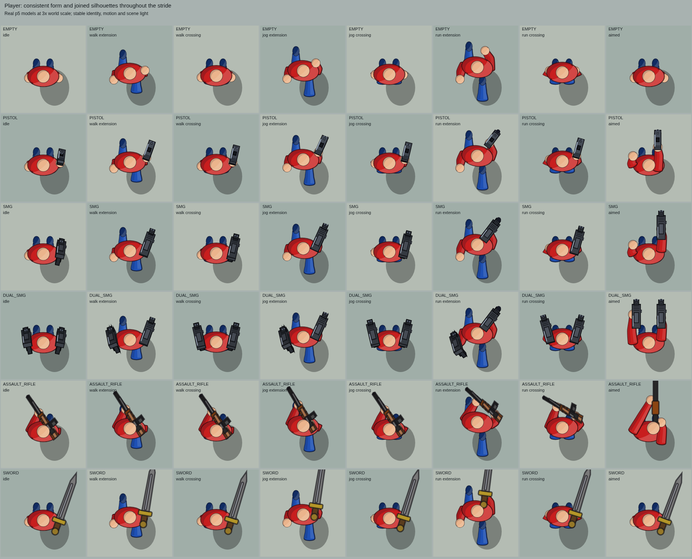
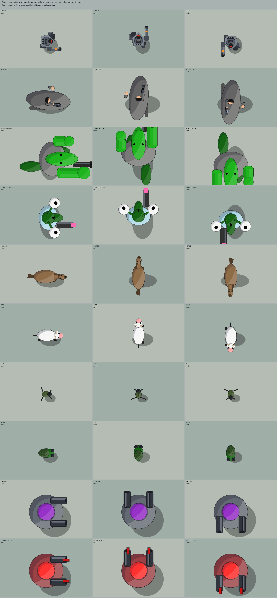

# Cel shaded character and entity volume

The player, combatants, citizens, creatures, machines and intact fallen figures
now use curved cel shaded surfaces. Shirts, skin, hair, headwear and equipment
keep their cartoon palettes and comic outlines. Sleeves and trouser legs have a
single tapered outline through the elbow or knee, with continuous shade bands.
Coat hems use shallow folds; armor and mechanical panels use inset bevels.

The existing rig supplies the poses and grip positions. Walking, jogging,
running, dual weapon carrying, reloads, left hand actions, boxing and falls use
the new surfaces without changing their action timers or collision dimensions.
Light stays aligned with the scene as figures turn.

## Browser previews

These sheets show the actual p5 models at three times world scale.

## Validation

The new `tools/check-figure-volume.js` passes 44 checks for surface containment,
continuous joint tangents, material alpha, world light, turning colors and real
entity/action poses. The character, render, depth, handgun, left action, citizen,
corpse, fall, airborne, robot, damage and wound suites pass. Browser review covered
588 pose cards and a 120-frame mobile control/firefight check with no JavaScript
errors and balanced painter state.

The Canvas path optimization matches the p5 path's pixels and painter state
across 480 poses. Other p5 versions, renderer modes and accessibility use p5's
normal paths.

## Rendering cost

The added surfaces cost more to draw. In headless Chromium with software
rendering, matched level 1/2 scenes with 17 or 49 visible figures added about
3–16 ms to median frame CPU time. These measurements are a comparison on this
environment, not a prediction of device FPS. Dense crowds remain the main
performance limitation. Scratch geometry, palette reuse and native Canvas curves
reduce allocations without changing the artwork.

`tools/check-perf.js` retains its timing thresholds. Its busy-frame timing check
fails with the added geometry in the headless tracing harness; a separate ally
formation source-pattern check also fails on the unchanged baseline.
